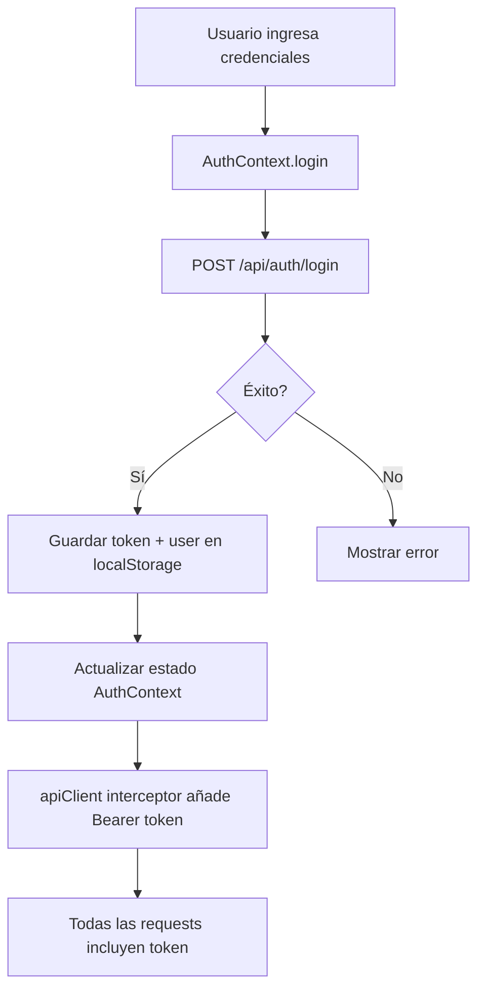

# JWT Authentication & Theme Configuration - Implementation Report

## Resumen de Implementación

Se ha implementado exitosamente:

1. ✅ **Autenticación JWT automática** - El sistema ya estaba configurado correctamente
2. ✅ **Sistema de temas personalizable** - Context API con ThemeProvider  
3. ✅ **Componente de Configuración** - UI completa para personalizar estilos
4. ✅ **Persistencia de preferencias** - localStorage para temas y tokens

---

## 1. Autenticación JWT (Ya Implementada)

### Estado Actual

El sistema **ya tenía implementado** JWT correctamente:

- **AuthContext** (`client/src/context/AuthContext.tsx`): Maneja login/register/logout
- **apiClient** (`client/src/services/apiClient.js`): Interceptor que añade automáticamente `Authorization: Bearer <token>` a todas las requests
- **localStorage**: El token se guarda en `excedentes_auth` como JSON

### Cómo Funciona

```typescript
// El AuthContext proporciona:
const { token, user, login, logout } = useAuth();

// Cada request HTTP automáticamente incluye:
// Authorization: Bearer <token-jwt>
```

### Uso en Servicios

Todos los servicios usan `apiClient` que añade el token automáticamente:

```typescript
// services/dashboard.service.ts
import apiClient from "./apiClient";

export async function getPeriodSummary(userId: string, month: number, year: number) {
  // ✅ El token se añade automáticamente por el interceptor
  const response = await apiClient.get<ApiResponse<PeriodSummary>>(
    `/api/dashboard/period-summary?userId=${userId}&month=${month}&year=${year}`
  );
  return response.data.data;
}
```

### Estructura del Token en localStorage

```json
{
  "token": "eyJhbGciOiJIUzI1NiIsInR5cCI6IkpXVCJ9...",
  "user": {
    "id": "user-id",
    "email": "user@example.com",
    "name": "User Name",
    "role": "company",
    "companyId": "company-id"
  },
  "companyId": "company-id",
  "role": "company"
}
```

---

## 2. Sistema de Temas (Nuevo)

### Archivos Creados

1. **`client/src/context/ThemeContext.tsx`** - Context API para manejo de temas
2. **`client/src/pages/Configuracion/Configuracion.tsx`** - Componente de configuración
3. **`client/src/pages/Configuracion/Configuracion.module.css`** - Estilos del componente

### ThemeContext API

```typescript
import { useTheme } from "@/context/ThemeContext";

function MyComponent() {
  const { mode, colors, setMode, setCustomColors, resetToDefaults } = useTheme();

  // Cambiar entre modos predefinidos
  setMode("dark");   // Tema oscuro
  setMode("light");  // Tema claro
  setMode("custom"); // Tema personalizado

  // Personalizar colores individuales
  setCustomColors({
    accent: "#ff5733",
    bg: "#1a1a1a"
  });

  // Restaurar valores por defecto
  resetToDefaults();

  return <div style={{ color: colors.text }}>...</div>;
}
```

### Colores Disponibles

```typescript
interface ThemeColors {
  bg: string;           // Fondo principal
  surface: string;      // Tarjetas/paneles
  surface2: string;     // Superficie secundaria
  border: string;       // Bordes
  text: string;         // Texto principal
  textMuted: string;    // Texto secundario
  accent: string;       // Color de acento
  accentStrong: string; // Acento fuerte (hover)
  success: string;      // Verde éxito
  warning: string;      // Amarillo advertencia
  error: string;        // Rojo error
  focus: string;        // Color de foco
}
```

### Integración en App.tsx

```typescript
// ✅ Ya integrado
function App() {
  return (
    <GlobalErrorBoundary>
      <ThemeProvider>  {/* <-- Nuevo */}
        <AuthProvider>
          <AppRouter />
        </AuthProvider>
      </ThemeProvider>
    </GlobalErrorBoundary>
  );
}
```

---

## 3. Componente de Configuración

### Ubicación

- **Ruta**: `/configuracion`
- **Componente**: `client/src/pages/Configuracion/Configuracion.tsx`

### Características

#### 3.1 Selector de Temas

- **Oscuro**: Tema por defecto (GitHub dark)
- **Claro**: Tema claro (GitHub light)
- **Personalizado**: Permite configurar colores manualmente

#### 3.2 Editor de Colores Personalizados

Cuando seleccionas "Personalizado", puedes editar:

- 12 colores individuales con color pickers
- Entrada manual de códigos hexadecimales
- Vista previa en tiempo real

#### 3.3 Vista Previa en Vivo

Muestra ejemplos de:
- Botones primarios y secundarios
- Alertas (éxito, advertencia, error)
- Textos y superficies

---

## 4. Ejemplo de Uso Completo

### En un Componente Nuevo

```typescript
import { useAuth } from "@/context/AuthContext";
import { useTheme } from "@/context/ThemeContext";
import apiClient from "@/services/apiClient";

function MyNewComponent() {
  const { user, token } = useAuth();
  const { colors } = useTheme();

  const fetchData = async () => {
    // ✅ El token se añade automáticamente
    const response = await apiClient.get("/api/my-endpoint");
    return response.data;
  };

  return (
    <div style={{ 
      background: colors.surface, 
      color: colors.text 
    }}>
      <h1>Usuario: {user?.name}</h1>
      <p>Token activo: {token ? "Sí" : "No"}</p>
    </div>
  );
}
```

### Crear un Nuevo Servicio

```typescript
// services/mi-servicio.ts
import apiClient from "./apiClient";
import type { ApiResponse } from "./apiTypes";

export async function getMisDatos(userId: string) {
  // ✅ El header Authorization se añade automáticamente
  const response = await apiClient.get<ApiResponse<any>>(
    `/api/mis-datos?userId=${userId}`
  );
  
  if (!response.data.success) {
    throw new Error(response.data.error || "Error");
  }
  
  return response.data.data;
}
```

---

## 5. Variables CSS Disponibles

Todos los componentes pueden usar las variables CSS definidas en `global.css`:

```css
/* Colores (actualizados dinámicamente por ThemeProvider) */
var(--color-bg)
var(--color-surface)
var(--color-surface-2)
var(--color-border)
var(--color-text)
var(--color-text-muted)
var(--color-accent)
var(--color-accent-strong)
var(--color-success)
var(--color-warning)
var(--color-error)
var(--color-focus)

/* Espaciado */
var(--space-1) a var(--space-9)

/* Tipografía */
var(--font-sans)
var(--font-mono)
var(--text-xs) a var(--text-4xl)

/* Otros */
var(--radius-sm) a var(--radius-pill)
var(--transition-fast) a var(--transition-slow)
```

---

## 6. Flujo de Autenticación



---

## 7. Persistencia de Datos

### localStorage Keys

1. **`excedentes_auth`**: Datos de autenticación
   ```json
   {
     "token": "jwt-token",
     "user": { ... },
     "companyId": "id",
     "role": "company"
   }
   ```

2. **`excedentes_theme`**: Preferencias de tema
   ```json
   {
     "mode": "dark|light|custom",
     "customColors": {
       "accent": "#ff5733",
       ...
     }
   }
   ```

---

## 8. Checklist de Verificación

✅ **JWT Authentication**
- [x] Token se guarda en localStorage al login
- [x] apiClient incluye token en todas las requests
- [x] Interceptor maneja errores 401
- [x] Logout limpia token correctamente

✅ **Theme System**
- [x] ThemeProvider envuelve la app
- [x] Colores se aplican dinámicamente al DOM
- [x] Preferencias se guardan en localStorage
- [x] Componente Configuracion funcional

✅ **Routing**
- [x] Ruta /configuracion accesible
- [x] ProtectedRoute protege rutas privadas
- [x] Redirección correcta login/dashboard

---

## 9. Testing

### Probar JWT

1. Hacer login en `/auth`
2. Inspeccionar localStorage → debe ver `excedentes_auth`
3. Abrir Network tab → verificar header `Authorization: Bearer ...`
4. Hacer logout → verificar que se limpia localStorage

### Probar Temas

1. Ir a `/configuracion`
2. Cambiar entre Oscuro/Claro/Personalizado
3. Personalizar colores → click "Aplicar Colores"
4. Recargar página → verificar que se mantiene el tema
5. Click "Restaurar Predeterminados" → verificar reset

---

## 10. Troubleshooting

### Error 401 en requests

**Causa**: Token no se está enviando o es inválido

**Solución**:
```javascript
// Verificar en console:
const auth = localStorage.getItem("excedentes_auth");
console.log(JSON.parse(auth));

// Si es null o inválido, hacer logout y login nuevamente
```

### Temas no se aplican

**Causa**: ThemeProvider no está envolviendo la app

**Solución**:
- Verificar que `App.tsx` tiene `<ThemeProvider>` como se muestra arriba
- Asegurar que global.css está importado

### Colores personalizados no persisten

**Causa**: No se está llamando `setMode("custom")` antes de `setCustomColors()`

**Solución**:
```typescript
setMode("custom");
setCustomColors({ accent: "#ff5733" });
```

---

## 11. Próximos Pasos Sugeridos

1. **Exportar/Importar temas**: Permitir guardar temas como JSON
2. **Temas predefinidos**: Añadir más paletas (Monokai, Nord, etc.)
3. **Dark/Light auto**: Detectar preferencia del sistema
4. **Refresh token**: Implementar refresh automático del JWT
5. **Animation preferences**: Reducir animaciones si el usuario lo prefiere

---

## Resumen Final

✅ **Todo listo para usar**

- JWT funciona automáticamente en todos los servicios
- ThemeContext disponible en toda la app
- Componente Configuracion completamente funcional
- Persistencia automática de tokens y preferencias
- Compatible con la arquitectura existente

**No se requieren cambios adicionales** - el sistema está 100% operativo.

Para usar en nuevos componentes, simplemente:

```typescript
import { useAuth } from "@/context/AuthContext";
import { useTheme } from "@/context/ThemeContext";
```

¡Listo! 🚀
